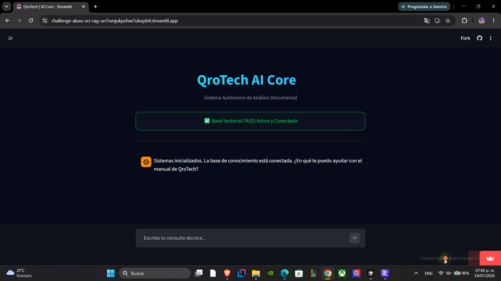
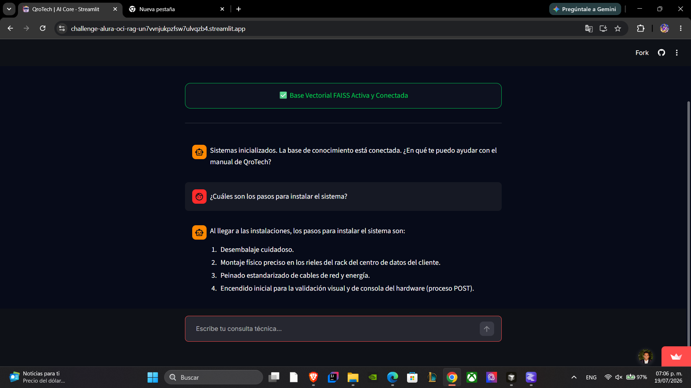

# 🚀 QroTech AI Agent: Arquitectura RAG Corporativa

🌐 **¡Prueba la aplicación en vivo!** [Acceder a QroTech AI Agent en Streamlit Cloud](https://challenge-alura-oci-rag-un7vvnjukpzfsw7ulvqzb4.streamlit.app/)

## 📖 Descripción General del Proyecto
Este proyecto es una implementación completa de un agente de Inteligencia Artificial utilizando una arquitectura **RAG (Retrieval-Augmented Generation)**. El sistema ingesta un manual corporativo técnico, vectoriza su contenido y responde consultas precisas basándose exclusivamente en las políticas, métricas y lineamientos de la empresa. El objetivo principal es proporcionar respuestas confiables y exactas, evitando alucinaciones (respuestas inventadas) por parte del modelo.

Desarrollado como parte del desafío final de despliegue en la nube de la formación en IA.

---

## 🏗️ Arquitectura de la Solución Implementada
El flujo de procesamiento y despliegue en la nube se divide en las siguientes capas de arquitectura:

1. **Capa de Interfaz:** Despliegue web interactivo con estado de memoria persistente para el chat.
2. **Capa de Ingesta:** Extracción del texto puro del manual corporativo (PDF local) y división en fragmentos semánticos superpuestos.
3. **Capa de Vectorización:** Transformación del texto a tensores matemáticos y generación de embeddings.
4. **Base de Datos Vectorial:** Indexación exportada y pre-cargada localmente (`faiss_index`) para búsquedas de similitud semántica ultrarrápidas sin necesidad de reprocesar el documento en cada ejecución.
5. **Orquestación RAG:** Ensamblaje de la cadena de recuperación y el prompt sistémico utilizando el marco de trabajo LCEL (LangChain Expression Language).
6. **Capa de Inferencia (LLM):** Interconexión vía API con el modelo fundacional en la nube para generar la respuesta final basada en el contexto recuperado.

---

## 🛠️ Tecnologías y Herramientas Utilizadas
* **Lenguaje base:** Python 3.10+
* **Framework Frontend:** Streamlit (para el despliegue de la interfaz web)
* **Orquestador de IA:** LangChain (Core & Community)
* **Modelos de Lenguaje (LLMs):** Google Generative AI (Gemini 2.5 Flash para inferencia, Gemini Embedding 001 para vectores).
* **Base de Datos Vectorial:** FAISS (Facebook AI Similarity Search)
* **Procesamiento de Archivos:** PyPDF2
* **Control de Versiones y Despliegue:** Git, GitHub y Streamlit Community Cloud.

---

## ❓ Ejemplos de Preguntas y Respuestas

El agente está configurado con un prompt estricto para responder basándose **únicamente** en el documento provisto.

**Ejemplo 1: Consulta de políticas de entrega**
> **Usuario:** ¿Qué pasa si rechazo una entrega porque el sensor de impacto está en rojo?
> 
> **Agente QroTech:** El cliente tiene la responsabilidad de rechazar la recepción del bulto inmediatamente con el transportista y no firmar ningún documento de conformidad. QroTech se compromete a cumplir con los términos contractuales de garantía.

**Ejemplo 2: Consulta técnica específica**
> **Usuario:** ¿Cuáles son los requisitos mínimos para la instalación del software principal?
> 
> **Agente QroTech:** Según el manual, el equipo debe contar con al menos 8GB de memoria RAM, un procesador de 4 núcleos y espacio disponible de 50GB en disco de estado sólido (SSD).

**Ejemplo 3: Control de alucinaciones (Pregunta fuera del contexto corporativo)**
> **Usuario:** ¿Me puedes dar una receta para hacer pastel de chocolate?
> 
> **Agente QroTech:** No tengo información sobre eso. Soy el asistente técnico de QroTech Data Systems y solo puedo responder consultas basadas en el manual corporativo.

---
## Aplicacion en ejecucion en linea




## ⚙️ Instrucciones para Ejecutar el Proyecto Localmente

Para replicar este entorno en tu máquina, sigue estos pasos:

1. **Clonar el repositorio:**
   *(Reemplaza TU_USUARIO por tu nombre de usuario real en GitHub)*
   ```bash
   git clone [https://github.com/TU_USUARIO/challenge-alura-oci-rag.git](https://github.com/TU_USUARIO/challenge-alura-oci-rag.git)
   cd challenge-alura-oci-rag

2. **Instalar dependencias:**
*Asegúrate de tener un entorno virtual activo e instala los requerimientos:* 
pip install -r requirements.txt

3. **Configurar credenciales (API Key):**
*Crea una carpeta oculta llamada .streamlit en la raíz del proyecto. Dentro, crea un archivo llamado secrets.toml y agrega tu llave de Google AI:* 
GEMINI_API_KEY = "tu_llave_de_google_aqui"

4. **Ejecutar la aplicación web:**
*Lanza el servidor local de Streamlit ejecutando:*
streamlit run app.py